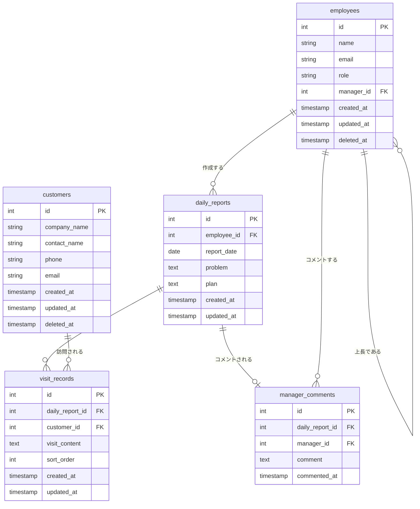

# 営業日報システム ER図

**バージョン:** 1.0  
**作成日:** 2026-04-20  
**対象システム:** 営業日報システム

---

## 目次

1. [エンティティ一覧](#1-エンティティ一覧)
2. [ER図（Mermaid）](#2-er図mermaid)
3. [テーブル定義](#3-テーブル定義)
4. [リレーションシップ定義](#4-リレーションシップ定義)
5. [制約・インデックス](#5-制約インデックス)

---

## 1. エンティティ一覧

| テーブル名 | 論理名 | 概要 |
|-----------|--------|------|
| employees | 社員 | 営業担当・上長を兼ねるマスタ。roleで役割を区別 |
| customers | 顧客 | 訪問対象の顧客情報マスタ |
| daily_reports | 日報 | 社員が1日1件作成する日報。problem/planを含む |
| visit_records | 訪問記録 | 日報に紐付く訪問先と内容（複数件可） |
| manager_comments | 上長コメント | 日報に対する上長からのコメント（1日報1件） |

---

## 2. ER図（Mermaid）

---

## 3. テーブル定義

### 3.1 employees（社員）

| カラム名 | データ型 | NULL | デフォルト | 説明 |
|---------|---------|------|-----------|------|
| id | INT | NOT NULL | AUTO_INCREMENT | 主キー |
| name | VARCHAR(50) | NOT NULL | - | 氏名 |
| email | VARCHAR(255) | NOT NULL | - | メールアドレス（ログインID） |
| password_hash | VARCHAR(255) | NOT NULL | - | パスワードハッシュ |
| role | ENUM('sales','manager','admin') | NOT NULL | 'sales' | ロール |
| manager_id | INT | NULL | NULL | 上長の社員ID（自己参照FK） |
| created_at | TIMESTAMP | NOT NULL | CURRENT_TIMESTAMP | 作成日時 |
| updated_at | TIMESTAMP | NOT NULL | CURRENT_TIMESTAMP | 更新日時 |
| deleted_at | TIMESTAMP | NULL | NULL | 論理削除日時 |

### 3.2 customers（顧客）

| カラム名 | データ型 | NULL | デフォルト | 説明 |
|---------|---------|------|-----------|------|
| id | INT | NOT NULL | AUTO_INCREMENT | 主キー |
| company_name | VARCHAR(100) | NOT NULL | - | 会社名 |
| contact_name | VARCHAR(50) | NOT NULL | - | 担当者名 |
| phone | VARCHAR(20) | NULL | NULL | 電話番号 |
| email | VARCHAR(255) | NULL | NULL | メールアドレス |
| created_at | TIMESTAMP | NOT NULL | CURRENT_TIMESTAMP | 作成日時 |
| updated_at | TIMESTAMP | NOT NULL | CURRENT_TIMESTAMP | 更新日時 |
| deleted_at | TIMESTAMP | NULL | NULL | 論理削除日時 |

### 3.3 daily_reports（日報）

| カラム名 | データ型 | NULL | デフォルト | 説明 |
|---------|---------|------|-----------|------|
| id | INT | NOT NULL | AUTO_INCREMENT | 主キー |
| employee_id | INT | NOT NULL | - | 作成者の社員ID（FK） |
| report_date | DATE | NOT NULL | - | 報告日 |
| problem | TEXT | NULL | NULL | 今日の課題・相談 |
| plan | TEXT | NULL | NULL | 明日やること |
| created_at | TIMESTAMP | NOT NULL | CURRENT_TIMESTAMP | 作成日時 |
| updated_at | TIMESTAMP | NOT NULL | CURRENT_TIMESTAMP | 更新日時 |

### 3.4 visit_records（訪問記録）

| カラム名 | データ型 | NULL | デフォルト | 説明 |
|---------|---------|------|-----------|------|
| id | INT | NOT NULL | AUTO_INCREMENT | 主キー |
| daily_report_id | INT | NOT NULL | - | 日報ID（FK） |
| customer_id | INT | NOT NULL | - | 顧客ID（FK） |
| visit_content | TEXT | NOT NULL | - | 訪問内容 |
| sort_order | INT | NOT NULL | 1 | 表示順（1始まり） |
| created_at | TIMESTAMP | NOT NULL | CURRENT_TIMESTAMP | 作成日時 |
| updated_at | TIMESTAMP | NOT NULL | CURRENT_TIMESTAMP | 更新日時 |

### 3.5 manager_comments（上長コメント）

| カラム名 | データ型 | NULL | デフォルト | 説明 |
|---------|---------|------|-----------|------|
| id | INT | NOT NULL | AUTO_INCREMENT | 主キー |
| daily_report_id | INT | NOT NULL | - | 日報ID（FK・ユニーク） |
| manager_id | INT | NOT NULL | - | コメントした上長の社員ID（FK） |
| comment | TEXT | NOT NULL | - | コメント本文 |
| commented_at | TIMESTAMP | NOT NULL | CURRENT_TIMESTAMP | コメント日時 |

---

## 4. リレーションシップ定義

| リレーション | 種別 | 説明 |
|-------------|------|------|
| employees → daily_reports | 1対多 | 1人の社員は複数の日報を作成できる |
| employees → employees | 1対多（自己参照） | 1人の上長は複数の部下を持てる |
| daily_reports → visit_records | 1対多 | 1つの日報は複数の訪問記録を持てる |
| customers → visit_records | 1対多 | 1つの顧客は複数の訪問記録に紐付く |
| daily_reports → manager_comments | 1対0または1 | 1つの日報に上長コメントは最大1件 |
| employees → manager_comments | 1対多 | 1人の上長は複数の日報にコメントできる |

---

## 5. 制約・インデックス

### 5.1 ユニーク制約

| テーブル | 対象カラム | 説明 |
|---------|-----------|------|
| employees | email | メールアドレスはシステム内で一意 |
| daily_reports | (employee_id, report_date) | 同一社員・同一日付の日報は1件のみ |
| manager_comments | daily_report_id | 1日報につきコメントは1件のみ |

### 5.2 外部キー制約

| テーブル | カラム | 参照先 | ON DELETE |
|---------|-------|--------|-----------|
| employees | manager_id | employees.id | SET NULL |
| daily_reports | employee_id | employees.id | RESTRICT |
| visit_records | daily_report_id | daily_reports.id | CASCADE |
| visit_records | customer_id | customers.id | RESTRICT |
| manager_comments | daily_report_id | daily_reports.id | CASCADE |
| manager_comments | manager_id | employees.id | RESTRICT |

### 5.3 インデックス

| テーブル | インデックス名 | 対象カラム | 種別 | 目的 |
|---------|--------------|-----------|------|------|
| employees | idx_employees_email | email | UNIQUE | ログイン検索の高速化 |
| employees | idx_employees_manager | manager_id | INDEX | 部下一覧取得の高速化 |
| daily_reports | idx_reports_employee_date | (employee_id, report_date) | UNIQUE | 重複チェック・一覧取得 |
| daily_reports | idx_reports_date | report_date | INDEX | 日付範囲検索の高速化 |
| visit_records | idx_visits_report | daily_report_id | INDEX | 日報紐付き取得 |
| visit_records | idx_visits_customer | customer_id | INDEX | 顧客別訪問履歴取得 |
| manager_comments | idx_comments_report | daily_report_id | UNIQUE | コメント存在チェック |

---

*以上*
