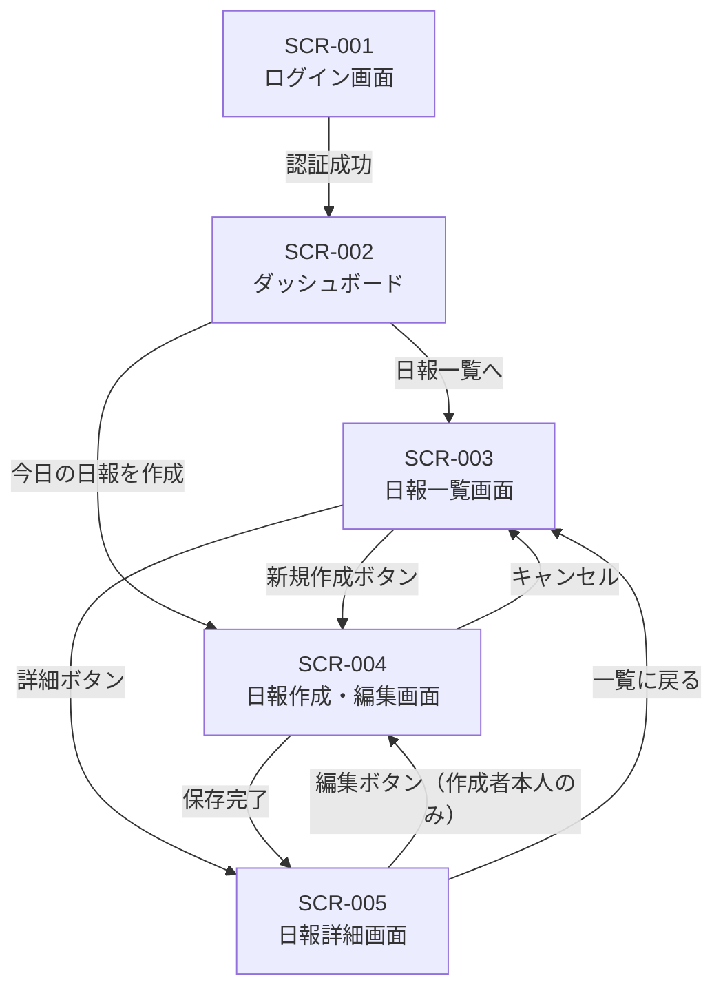
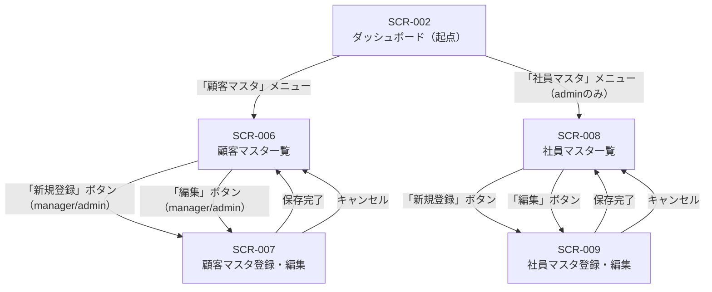

# 営業日報システム 画面遷移図

**バージョン:** 1.0  
**作成日:** 2026-04-20  
**対象システム:** 営業日報システム

---

## 目次

1. [画面遷移の全体概要](#1-画面遷移の全体概要)
2. [日報系 画面遷移図](#2-日報系-画面遷移図)
3. [マスタ管理系 画面遷移図](#3-マスタ管理系-画面遷移図)
4. [ロール別 利用可能画面まとめ](#4-ロール別-利用可能画面まとめ)
5. [遷移トリガー一覧](#5-遷移トリガー一覧)

---

## 1. 画面遷移の全体概要

全画面はログイン（SCR-001）を経由して利用します。認証後はダッシュボード（SCR-002）を起点に、日報系とマスタ管理系の2系統に分岐します。

```
[未認証]
    |
    v
SCR-001 ログイン画面
    |
    | 認証成功
    v
SCR-002 ダッシュボード  ←─── 全画面からの「ホームへ戻る」
    |               |
    | 日報系         | マスタ管理系
    v               v
 （第2章）        （第3章）
```

---

## 2. 日報系 画面遷移図

### 2.1 Mermaid 図



### 2.2 テキスト記述

```
SCR-001 ログイン画面
  │
  │ [認証成功]
  ▼
SCR-002 ダッシュボード
  │                    │
  │ [日報一覧へ]        │ [今日の日報を作成]
  ▼                    │
SCR-003 日報一覧画面    │
  │            │       │
  │ [新規作成]  │[詳細] │
  ▼            ▼       ▼
SCR-004 日報作成・編集画面
  │                    │
  │ [保存完了]          │ [キャンセル]
  ▼                    ▼
SCR-005 日報詳細画面  SCR-003 日報一覧画面
  │
  │ [一覧に戻る]
  ▼
SCR-003 日報一覧画面
```

### 2.3 各遷移の詳細

| 遷移元 | 遷移先 | トリガー | 権限条件 |
|--------|--------|----------|----------|
| SCR-001 | SCR-002 | ログインボタン押下・認証成功 | 全ユーザー |
| SCR-002 | SCR-003 | 「日報一覧」メニュークリック | 全ユーザー |
| SCR-002 | SCR-004 | 「今日の日報を作成」ボタン押下 | sales / admin |
| SCR-003 | SCR-004 | 「新規作成」ボタン押下 | sales / admin |
| SCR-003 | SCR-005 | 「詳細」ボタン押下 | 全ユーザー（権限範囲内） |
| SCR-004 | SCR-005 | 「保存する」ボタン押下・保存成功 | 作成者本人 |
| SCR-004 | SCR-003 | 「キャンセル」ボタン押下 | 作成者本人 |
| SCR-005 | SCR-004 | 「編集」ボタン押下 | 日報作成者本人のみ表示 |
| SCR-005 | SCR-003 | 「一覧に戻る」ボタン押下 | 全ユーザー |

### 2.4 補足事項

- ダッシュボード（SCR-002）に表示される「今日の日報を編集」は、当日分の日報が作成済みの場合のみ表示されます。
- 日報詳細（SCR-005）の上長コメント入力欄は、`manager` / `admin` ロールかつ未コメントの場合のみ表示されます。コメント後は閲覧のみとなり、画面遷移は発生しません。
- `sales` ロールのユーザーが他人の日報URLを直接入力した場合、403エラー画面に遷移します。

---

## 3. マスタ管理系 画面遷移図

### 3.1 Mermaid 図



### 3.2 テキスト記述

```
SCR-002 ダッシュボード
  │                          │
  │ [顧客マスタメニュー]      │ [社員マスタメニュー]
  │  全ロール可               │  admin のみ
  ▼                          ▼
SCR-006 顧客マスタ一覧      SCR-008 社員マスタ一覧
  │                          │
  │ [新規登録 / 編集]         │ [新規登録 / 編集]
  │  manager / admin のみ     │  admin のみ
  ▼                          ▼
SCR-007 顧客マスタ登録・編集 SCR-009 社員マスタ登録・編集
  │                          │
  │ [保存完了 / キャンセル]   │ [保存完了 / キャンセル]
  ▼                          ▼
SCR-006 顧客マスタ一覧      SCR-008 社員マスタ一覧
```

### 3.3 各遷移の詳細

| 遷移元 | 遷移先 | トリガー | 権限条件 |
|--------|--------|----------|----------|
| SCR-002 | SCR-006 | 「顧客マスタ」メニュークリック | 全ユーザー |
| SCR-002 | SCR-008 | 「社員マスタ」メニュークリック | admin のみ |
| SCR-006 | SCR-007（新規） | 「新規登録」ボタン押下 | manager / admin |
| SCR-006 | SCR-007（編集） | 「編集」ボタン押下 | manager / admin |
| SCR-007 | SCR-006 | 「保存する」ボタン押下・保存成功 | manager / admin |
| SCR-007 | SCR-006 | 「キャンセル」ボタン押下 | manager / admin |
| SCR-008 | SCR-009（新規） | 「新規登録」ボタン押下 | admin のみ |
| SCR-008 | SCR-009（編集） | 「編集」ボタン押下 | admin のみ |
| SCR-009 | SCR-008 | 「保存する」ボタン押下・保存成功 | admin のみ |
| SCR-009 | SCR-008 | 「キャンセル」ボタン押下 | admin のみ |

### 3.4 補足事項

- 顧客マスタ一覧（SCR-006）は全ロールが閲覧可能ですが、「新規登録」「編集」ボタンは `manager` / `admin` にのみ表示されます。
- 顧客詳細はモーダルで表示するため、独立した画面遷移は発生しません。
- 社員マスタ（SCR-008/009）はサイドナビに `admin` ロールのみ表示されます。`sales` / `manager` がURLを直接入力した場合は403エラー画面に遷移します。
- 顧客削除は `admin` のみ実行可能で、論理削除のため遷移先は一覧（SCR-006）のままです。

---

## 4. ロール別 利用可能画面まとめ

| 画面ID | 画面名 | sales | manager | admin |
|--------|--------|:-----:|:-------:|:-----:|
| SCR-001 | ログイン画面 | ○ | ○ | ○ |
| SCR-002 | ダッシュボード | ○ | ○ | ○ |
| SCR-003 | 日報一覧画面 | ○（自分のみ） | ○（部下含む） | ○（全員） |
| SCR-004 | 日報作成・編集画面 | ○（自分のみ） | × | ○ |
| SCR-005 | 日報詳細画面 | ○（自分のみ） | ○（部下含む） | ○（全員） |
| SCR-006 | 顧客マスタ一覧 | ○（閲覧のみ） | ○（編集可） | ○（編集・削除可） |
| SCR-007 | 顧客マスタ登録・編集 | × | ○ | ○ |
| SCR-008 | 社員マスタ一覧 | × | × | ○ |
| SCR-009 | 社員マスタ登録・編集 | × | × | ○ |

---

## 5. 遷移トリガー一覧

全遷移のトリガーを種別ごとに整理します。

### 5.1 ナビゲーションによる遷移（サイドメニュー）

| メニュー項目 | 遷移先 | 表示条件 |
|-------------|--------|----------|
| ダッシュボード | SCR-002 | 全ロール |
| 日報一覧 | SCR-003 | 全ロール |
| 顧客マスタ | SCR-006 | 全ロール |
| 社員マスタ | SCR-008 | admin のみ |

### 5.2 ボタン操作による遷移

| ボタン名 | 遷移元 | 遷移先 | 表示条件 |
|----------|--------|--------|----------|
| 今日の日報を作成 | SCR-002 | SCR-004 | sales / admin、当日未作成時 |
| 今日の日報を編集 | SCR-002 | SCR-004 | sales / admin、当日作成済み時 |
| 新規作成（日報） | SCR-003 | SCR-004 | sales / admin |
| 詳細（日報） | SCR-003 | SCR-005 | 全ロール（権限範囲内） |
| 編集（日報） | SCR-003 / SCR-005 | SCR-004 | 日報作成者本人のみ |
| 一覧に戻る | SCR-005 | SCR-003 | 全ロール |
| 新規登録（顧客） | SCR-006 | SCR-007 | manager / admin |
| 編集（顧客） | SCR-006 | SCR-007 | manager / admin |
| 新規登録（社員） | SCR-008 | SCR-009 | admin |
| 編集（社員） | SCR-008 | SCR-009 | admin |

### 5.3 処理完了による自動遷移

| 処理内容 | 遷移元 | 遷移先 |
|----------|--------|--------|
| ログイン成功 | SCR-001 | SCR-002 |
| 日報保存成功 | SCR-004 | SCR-005 |
| 顧客情報保存成功 | SCR-007 | SCR-006 |
| 社員情報保存成功 | SCR-009 | SCR-008 |

### 5.4 エラー・例外時の遷移

| 発生条件 | 遷移先 |
|----------|--------|
| 認証トークン期限切れ・無効 | SCR-001（ログイン画面） |
| 権限のないページへのアクセス | 403エラー画面 |
| 存在しないリソースへのアクセス | 404エラー画面 |
| キャンセルボタン押下（確認ダイアログOK後） | 一覧画面（直前の一覧画面）へ戻る |

---

*以上*
